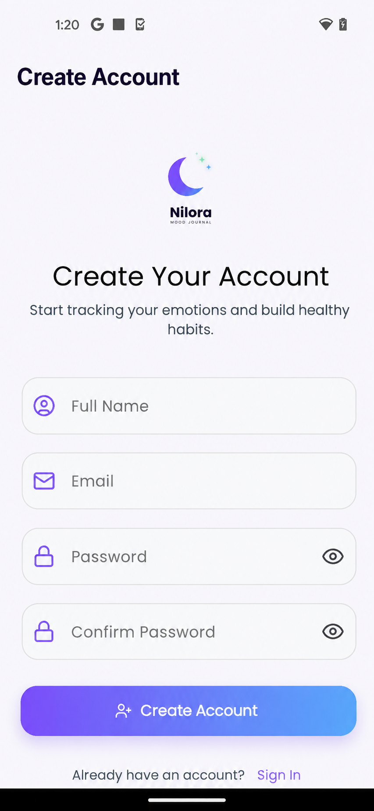
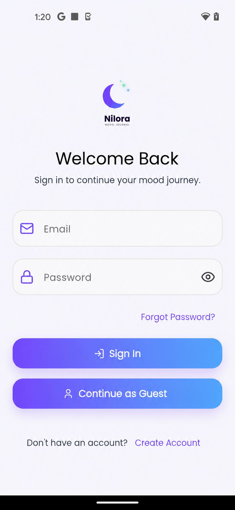
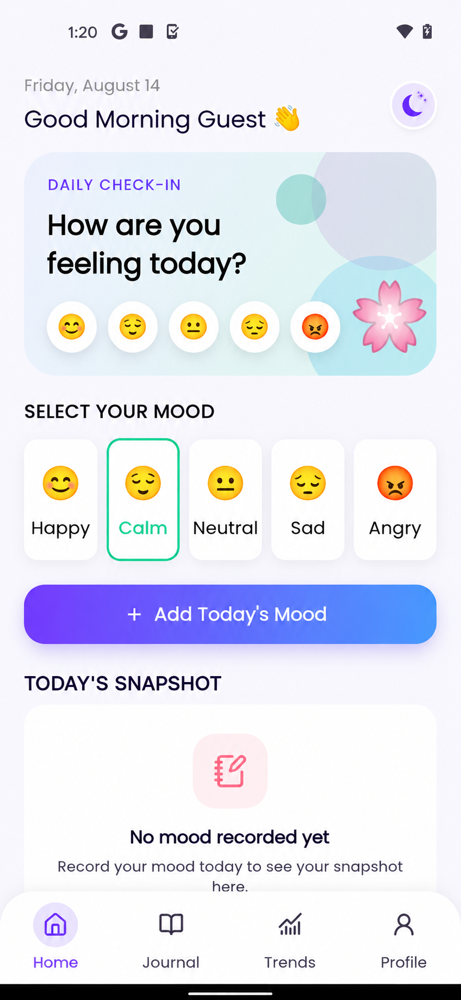
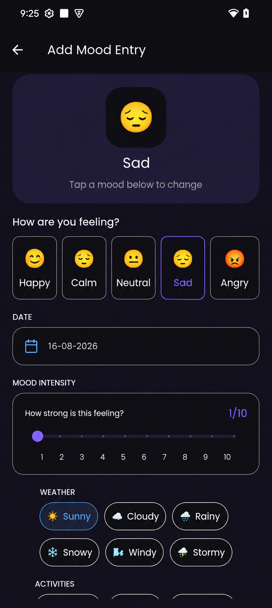

<div align="center">

# 🌙 Nilora — Mood Journal

### A modern Flutter application for tracking moods, journaling daily experiences, and understanding emotional patterns.

<br/>


<br/>

**Flutter • Dart • GetX • Firebase Authentication • SQLite • GetStorage • fl_chart**

</div>

---

## 📖 About Nilora

**Nilora** is a Flutter-based mood journaling application designed to help users record their emotions, write personal journal entries, track mood intensity, activities, and weather, and review mood patterns over time.

The project focuses on:

- Clean and maintainable Flutter code
- Feature-based project structure
- GetX state management
- Firebase Authentication
- SQLite local persistence
- Responsive user interfaces
- Reusable widgets
- Light and dark themes
- Mood visualization and trends
- Offline-first journal storage

Nilora is also a personal portfolio project built to demonstrate practical Flutter development skills and production-oriented application structure.

---

## 📱 Screenshots

> Add your real application screenshots inside a `screenshots/` folder.

<div align="center">

&nbsp;

&nbsp;

    
<br/><br/>

<!-- 
&nbsp;

&nbsp;
 -->

</div>

---

## ✨ Features

### 🔐 Authentication

- Email and password registration
- Email and password login
- Firebase Authentication
- Password reset support
- Authentication state handling
- Splash-screen authentication check

### 😊 Mood Tracking

Users can record different emotional states such as:

- 😊 Happy
- 😌 Calm
- 😐 Neutral
- 😢 Sad
- 😠 Angry

Each mood entry can also include additional information such as:

- Mood intensity
- Weather
- Activities
- Journal title
- Journal notes
- Date and time

### 📝 Journal

- Create mood journal entries
- View previous journal entries
- View detailed journal information
- Display mood emoji and mood color
- Store journal data locally
- Organize entries using date and time

### 🎚️ Mood Intensity

Users can record mood intensity using a scale from:

```text
1 ─────────────────────────────── 10
Low                             High
```

This allows mood tracking to contain more detail than only selecting an emotion.

### ☀️ Weather Tracking

Mood entries can contain weather information such as:

```text
☀️ Sunny
☁️ Cloudy
🌧️ Rainy
```

### 🏃 Activity Tracking

Users can associate activities with their mood entries.

Example activities:

```text
Work
Reading
Exercise
Relaxing
Social
Travel
```

Multiple activities can be selected for a single journal entry.

---

## 🏠 Home Dashboard

The Home screen provides a quick overview of the user's current mood activity.

It includes:

- Personalized greeting
- Current date
- Mood selector
- Quick mood entry access
- Today's mood snapshot
- Latest mood information
- Bottom navigation
- Profile access

---

## 📊 Mood Trends

Nilora includes a Trends section designed to help users understand their emotional patterns.

Current trend-related UI includes:

- Average mood score
- Mood history
- Total entries
- Mood streak information
- Weekly mood visualization
- Mood pattern insights

Charts are implemented using:

```text
fl_chart
```

---

## 👤 Profile Management

The Profile section includes:

- User name
- Profile image
- User bio
- Edit profile
- Local profile information
- Logout
- Light/Dark theme support

Profile-related information can be stored locally using SQLite and lightweight persistent storage.

---

## 🌗 Light & Dark Theme

Nilora supports both:

```text
☀️ Light Mode
🌙 Dark Mode
```

The application uses Flutter's theme system and reusable design tokens to provide consistent colors, spacing, typography, and components.

---

# 🛠️ Tech Stack

| Technology | Purpose |
|---|---|
| Flutter | Cross-platform application development |
| Dart | Programming language |
| GetX | State management, routing and dependency injection |
| Firebase Auth | Email/password authentication |
| SQLite | Local database |
| GetStorage | Lightweight persistent key-value storage |
| fl_chart | Mood charts and trend visualization |
| Image Picker | Profile image selection |
| Path Provider | Local file path management |
| Google Fonts | Application typography |
| Intl | Date and time formatting |
| Lucide Flutter | Application icons |
| Flutter SVG | SVG assets |
| Permission Handler | Device permissions |
| Share Plus | Sharing functionality |

---

# 🏗️ Architecture

Nilora follows a **feature-based layered architecture**.

The goal is to keep UI, business logic, data access, models, controllers, and reusable components separated.

```text
lib/
│
└── src/
    │
    ├── app/
    │   ├── bindings/
    │   ├── routes/
    │   └── theme/
    │
    ├── core/
    │   ├── constants/
    │   ├── database/
    │   ├── errors/
    │   ├── services/
    │   └── utilities/
    │
    ├── features/
    │   │
    │   ├── auth/
    │   │   ├── data/
    │   │   └── presentation/
    │   │
    │   ├── home/
    │   │   └── presentation/
    │   │
    │   ├── journal/
    │   │   ├── data/
    │   │   └── presentation/
    │   │
    │   ├── mood/
    │   │   ├── data/
    │   │   ├── domain/
    │   │   └── presentation/
    │   │
    │   ├── trends/
    │   │   └── presentation/
    │   │
    │   ├── profile/
    │   │   ├── data/
    │   │   └── presentation/
    │   │
    │   ├── onboarding/
    │   │   └── presentation/
    │   │
    │   └── splash/
    │       └── presentation/
    │
    └── shared/
        └── widgets/
```

---

# 🔄 Application Flow

```text
Splash Screen
      │
      ▼
Authentication Check
      │
      ├─────────────── Not Logged In
      │                       │
      │                       ▼
      │                 Login / Register
      │                       │
      │                       ▼
      └──────────────────► Home
                              │
          ┌───────────────────┼───────────────────┐
          │                   │                   │
          ▼                   ▼                   ▼
       Journal             Trends              Profile
          │
          ▼
   Journal Details
```

---

# ⚡ State Management — GetX

Nilora uses **GetX** for application state management.

GetX is used for:

- Reactive state
- Controllers
- Dependency injection
- Navigation
- Route management
- Controller lifecycle
- UI updates

Example:

```dart
class HomeController extends GetxController {
  final selectedMood = ''.obs;

  void selectMood(String mood) {
    selectedMood.value = mood;
  }
}
```

The UI can react using:

```dart
Obx(() {
  return Text(controller.selectedMood.value);
});
```

---

# 🧩 Dependency Injection

GetX is also used for dependency management.

Examples include:

```dart
Get.put(HomeController());
```

```dart
Get.lazyPut(() => JournalController());
```

Controllers can then be accessed using:

```dart
Get.find<HomeController>();
```

This helps reduce tight coupling between screens and application logic.

---

# 🧭 Navigation

Nilora uses **GetX navigation** with `GetMaterialApp`.

Example:

```dart
Get.toNamed(AppRoutes.mood);
```

Named routes help keep navigation organized and reusable throughout the application.

---

# 🔐 Firebase Authentication

Firebase Authentication handles account-related functionality.

The authentication flow supports:

```text
Create Account
      ↓
Firebase Authentication
      ↓
Login
      ↓
Authenticated Session
      ↓
Home
```

Authentication is handled by Firebase while journal and mood data are primarily stored locally.

---

# 💾 SQLite Local Database

Nilora uses SQLite for persistent application data.

Mood entries can contain fields such as:

```text
Mood
Mood Intensity
Weather
Activities
Journal Title
Journal Notes
Created Date
Created Time
```

Using SQLite provides:

- Persistent local data
- Fast reads
- Offline availability
- Structured journal storage
- No permanent internet requirement for journal access

---

# 📦 GetStorage

`GetStorage` is used for lightweight persistent values that do not require relational database storage.

Examples may include:

- User display preferences
- User name
- Profile image path
- Small application settings

---

# 🎨 Reusable UI Components

Nilora uses reusable Flutter widgets to reduce duplicated UI code.

Examples include:

```text
MoodSelector
MoodItem
AppGradientButton
AppBottomNavigation
JournalCard
TrendStatCard
InsightTile
Greeting
PageIndicator
LogoutButton
```

Reusable widgets make the application easier to:

- Maintain
- Extend
- Test
- Style consistently

---

# 📐 Responsive Design

The UI is designed to adapt across different mobile screen sizes.

Nilora uses reusable design tokens such as:

```text
AppSpacing
AppIconSizes
AppDesignTokens
```

The application also uses:

```dart
MediaQuery
LayoutBuilder
Theme.of(context)
SafeArea
```

where appropriate to maintain responsive layouts.

---

# 🎨 Design System

Nilora uses reusable styling and design constants to maintain consistency.

Examples include:

```text
Colors
Spacing
Typography
Icon sizes
Border radius
Theme values
Light theme
Dark theme
```

This reduces hard-coded values across screens.

---

# 📊 Data Visualization

Mood statistics and weekly trends are displayed using:

```text
fl_chart
```

Example trend data:

```text
Mon    😊
Tue    😌
Wed    😐
Thu    😊
Fri    😢
Sat    😊
Sun    😌
```

These values can be converted into mood scores and displayed visually.

---

# 🛡️ Error Handling

The project aims to provide user-friendly handling for common application states.

Examples include:

- Firebase authentication errors
- Invalid form input
- Database errors
- Empty journal states
- Loading states
- Image selection errors
- Network-related errors

Errors should be presented to the user using clear messages rather than exposing raw technical exceptions.

---

# 📱 Supported Platforms

Nilora is primarily developed for:

```text
✅ Android
```

The Flutter project structure also supports further platform development where required.

---

# 📲 Portrait Orientation

The application is designed primarily for portrait mobile usage.

Recommended orientation:

```text
Portrait Up
Portrait Down
```

This helps maintain the intended UI layout across devices.

---

# 🚀 Getting Started

## Prerequisites

Before running the application, make sure you have:

- Flutter SDK
- Dart SDK
- Android Studio or VS Code
- Android SDK
- Android emulator or physical device
- Firebase project

Check your Flutter setup:

```bash
flutter doctor
```

---

## 1. Clone the Repository

```bash
git clone https://github.com/Muthamilselvanv/Mood_Journal.git
```

Move into the project:

```bash
cd Mood_Journal
```

---

## 2. Install Dependencies

```bash
flutter pub get
```

---

## 3. Configure Firebase

Create a Firebase project from the Firebase Console.

Enable:

```text
Authentication
    └── Sign-in method
        └── Email / Password
```

Then configure Firebase for the Flutter project.

For Android, add the required Firebase configuration according to the Firebase setup process.

If FlutterFire CLI is being used:

```bash
dart pub global activate flutterfire_cli
```

Then:

```bash
flutterfire configure
```

---

## 4. Run the Application

```bash
flutter run
```

---

# 🔒 Security

Sensitive data should never be committed directly to a public repository.

Avoid committing:

```text
API secrets
Private keys
Service-account files
Production credentials
Environment secrets
```

Firebase client configuration should still be protected using proper Firebase Security Rules and backend authorization where applicable.

---

# 🧪 Testing

Run Flutter tests using:

```bash
flutter test
```

Testing is an area of continued improvement for Nilora.

Planned testing coverage includes:

- Unit tests
- Widget tests
- Controller tests
- Repository tests
- Authentication flow testing
- SQLite data tests
- Integration tests

---

# 🧹 Code Quality

The project focuses on:

- Dart null safety
- Consistent naming
- Reusable widgets
- Feature-based organization
- Separation of UI and business logic
- Controller-based state management
- Centralized design tokens
- Error handling
- Reduced duplicated code
- Maintainable architecture

Before committing changes, the following commands can be used:

```bash
dart format .
```

```bash
flutter analyze
```

```bash
flutter test
```

---

# 🗺️ Roadmap

Future improvements planned for Nilora include:

- ☁️ Cloud synchronization
- 🔔 Daily mood reminder notifications
- 📊 Advanced mood analytics
- 📅 Calendar-based journal view
- 🔎 Journal search
- 🏷️ Journal tags
- 🎯 Mood goals
- 📤 Journal export
- 🔗 Journal sharing
- 🔐 Google Sign-In
- ☁️ Cloud backup and restore
- 🧪 More automated tests
- 🚀 GitHub Actions CI/CD
- ♿ Improved accessibility
- 📊 More detailed mood insights
- 🔄 Multi-device synchronization

> These are planned improvements and may not yet be available in the current release.

---

# 🎯 What This Project Demonstrates

Nilora demonstrates practical experience with:

```text
Flutter Application Development
Dart
GetX
Reactive State Management
Dependency Injection
Named Routing
Firebase Authentication
SQLite
GetStorage
Local Persistence
Offline Data Handling
Responsive UI
Reusable Widgets
Theme Management
Light/Dark Mode
Data Visualization
Form Validation
Profile Management
Feature-Based Architecture
```

---

# 📌 Project Status

```text
Project: Nilora — Mood Journal
Platform: Flutter
Status: Active Development
Primary Platform: Android
```

The application continues to receive improvements in architecture, authentication, persistence, testing, UI, and user experience.

---

# 👨‍💻 Developer

<div align="center">

### Muthamil Selvan

**Flutter Mobile App Developer**

Building cross-platform mobile applications using Flutter and Dart with a focus on clean UI, maintainable code, API integration, Firebase, and local persistence.

<br/>

[](https://github.com/Muthamilselvanv)

[](https://muthamilselvan-portfolio.web.app)

</div>

---

## ⭐ Support

If you find this project useful, consider giving the repository a ⭐.

It helps support the project and future improvements.

---

<div align="center">

### Made with Flutter 💙

**Clean Code • Better UX • Continuous Learning**

</div>
